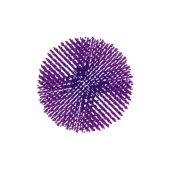
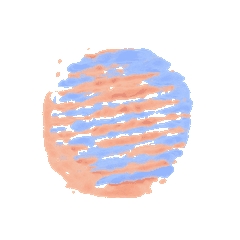
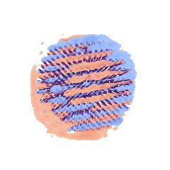

(overview)=
## Overview

We develop methods and instrumentation for diffractive imaging in electron microscopy, combining experiment, computation, and theory.

In our measurements, a converged electron probe is scanned across a thin specimen.
At each probe position, we record the far-field diffraction pattern, i.e. the probability density of the scattered electron wavefunction, producing a rich four-dimensional dataset (two scan dimensions and two diffraction dimensions) [@10.1017/s1431927619000497].

From these diffraction intensities, we computationally reconstruct the underlying scattering sources inside the material.
This enables quantitative recovery of structure, electromagnetic fields, and phase information that are not directly observable.
These approaches are powerful for both functional materials in the physical sciences and dose-sensitive samples in the life sciences, where maximizing information per electron is essential.

(stem-experiment)=
### A 4D-STEM experiment

The interactive widget below simulates a converged electron probe scattering through gold nanoparticles on an amorphous carbon film.

Press **scan** to raster the probe across the field and fill the four signal panels, or hover over the scene to drive it yourself and click to pin it.

:::{anywidget} https://curiousbeams.github.io/em-widgets/observable-notebook.mjs
{
  // the body is JSON5 — comments and unquoted keys are fine
  notebook: "https://curiousbeams.github.io/em-widgets/notebooks/stem-experiment.html",
  cells: ["stemExperiment", "readoutView"],
}
:::

(em-method-development)=
## Electron Microscopy Method Development

A physical detector records intensities, so the phase of the scattered wave, which carries most of the physics, is never measured directly.
Recovering it is what turns a set of diffraction patterns into a quantitative image of the specimen, and is possible due to the large diversity and redundancy in 4D-STEM measurements [@10.1557/s43577-026-01100-3].

The three widgets below illustrate where such phase information lives in the measurement, how to invert it in a single step, and what to do when a single step is not enough.

(aperture-overlap)=
### The aperture overlap

Two parts of the converged beam that leave the specimen in the same direction arrive at the same detector pixel and interfere there.
The overlap function describes that interference, and the direct methods are built on it [@10.1098/rsta.1992.0050].

Drag the marker on the bright-field disc to choose a detector pixel, and the marker on the frequency plane to choose a spatial frequency.
Phase information is carried where two or three of the aperture discs overlap, and the aberration panels illustrate how the lens encodes additional interference.

:::{anywidget} https://curiousbeams.github.io/em-widgets/observable-notebook.mjs
{
  notebook: "https://curiousbeams.github.io/em-widgets/notebooks/aperture-overlap.html",
  cells: ["overlapView", "readoutView"],
}
:::

(direct-ptychography)=
### Direct methods

Under the weak-phase object approximation (WPOA) [@10.1016/j.ultramic.2013.08.002], the aperture overlap function above can be inverted directly in a single step using one of five estimators: single side band (SSB) [@10.1016/j.ultramic.2014.09.013; @10.1016/j.ultramic.2016.09.002], optimum bright field (OBF) [@10.1016/j.ultramic.2020.113133], parallax and phase-flipped parallax [@10.1038/s41592-025-02834-9; @10.1093/mam/ozaf139], and integrated centre of mass (iCOM) [@10.1016/j.ultramic.2015.10.011].
The widget below illustrates the unified direct ptychography algorithm as a loop over bright-field (BF) pixels [@10.1557/s43577-026-01100-3].

Press **play** to sweep the detector pixel across the bright-field disc while the reconstruction accumulates.

:::{anywidget} https://curiousbeams.github.io/em-widgets/observable-notebook.mjs
{
  notebook: "https://curiousbeams.github.io/em-widgets/notebooks/direct-ptychography.html",
  cells: ["controlsView", "pipelineView", "readoutView"],
}
:::

(iterative-ptychography)=
### Iterative ptychography

The direct methods invert a linear estimator under the WPOA. 
The ptychographical iterative engine (ePIE) [@10.1016/j.ultramic.2009.05.012] solves the nonlinear inverse problem by model-based iterative optimization.
It keeps a guess at the specimen and, for each scan position, models the detector intensities, replaces the modelled amplitude with the measured one, and pushes the phase difference back into the specimen guess.

**Hover the specimen** to put the probe somewhere and take one update there, which shows what a single scan position contributes.
**Play** visits every position in a shuffled order.
**Inspect** runs the calculation at each position you pass over without applying it, so a converged reconstruction can be asked what it still sees.

:::{anywidget} https://curiousbeams.github.io/em-widgets/observable-notebook.mjs
{
  notebook: "https://curiousbeams.github.io/em-widgets/notebooks/iterative-ptychography.html",
  cells: ["controlsView", "cycleView", "errorView", "readoutView"],
}
:::

::::{dropdown} Proximal Gradient Methods
The step that replaces the modelled amplitude with the measured one is a projection: it returns the nearest wave with the amplitude that was recorded.
Alternating projections between two sets converges to a point in both of them when the sets are convex, and the sets in a phase-retrieval problem are not.

This widget runs the same operation in two dimensions, where the whole trajectory fits on the screen and the iterate can be watched stalling at a point that satisfies neither constraint.
The relaxations that get it moving again, such as the difference map and RAAR, are proximal gradient methods applied to the same two projections [@10.1364/ao.21.002758; @10.1364/josaa.20.000040].

:::{anywidget} https://curiousbeams.github.io/em-widgets/observable-notebook.mjs
{
  notebook: "https://curiousbeams.github.io/em-widgets/notebooks/projection-sets.html",
  cells: ["controlsView", "parametersView", "playbackView", "legendView", "sceneView", "convergenceView", "readoutView"],
}
:::
::::

(electron-optics)=
## Electron Optics Instrumentation

The methods described above are sensitive to the incoming illumination, so we also develop electron optics that tune the probe.
The widgets here go from the ray diagram of a whole column down to the field of a single lens and the aberrations it carries.

(electron-column)=
### The column

An SEM column and a scanning transmission electron microscope (STEM) column use a similar set of electro-optical components with different settings.
Drag the lenses and apertures to move the crossovers, converge the probe, and change the working distance.

:::{anywidget} https://curiousbeams.github.io/em-widgets/observable-notebook.mjs
{
  notebook: "https://curiousbeams.github.io/em-widgets/notebooks/electron-column.html",
  cells: ["electronColumn", "readoutView"],
}
:::

(paraxial-rays)=
### Rays through a real lens

Ray-transfer matrices treat a lens as a thin plane with a specific focal length.
A real lens is a field that the electron is integrated through, and this widget integrates it: the axial field of a magnetic (Glaser) or electrostatic (Schiske) lens, and the paraxial equation of motion, which together say where the rays cross.

:::{anywidget} https://curiousbeams.github.io/em-widgets/observable-notebook.mjs
{
  notebook: "https://curiousbeams.github.io/em-widgets/notebooks/paraxial-rays.html",
  cells: ["paraxialRays", "readoutView"],
}
:::

(non-paraxial-rays)=
### What the paraxial approximation leaves out

The same field, with the coupled three-dimensional ray equations carried to third order.
Two things appear that the paraxial equation cannot show: the bundle rotates about the optic axis as it passes through a magnetic lens, and rays that enter further from the axis cross it sooner than rays that enter close to it.

Drag the scene to turn it, and move the detector away from the waist to see the spot the aberration leaves.

:::{anywidget} https://curiousbeams.github.io/em-widgets/observable-notebook.mjs
{
  notebook: "https://curiousbeams.github.io/em-widgets/notebooks/non-paraxial-rays.html",
  cells: ["nonParaxialRays", "readoutView"],
}
:::

::::{dropdown} Principle of Reciprocity

The phase-retrieval techniques introduced above rely on the principle of reciprocity [@10.1063/1.1652901]:
Reversing every ray in the column and swapping the source for the detector turns a bright-field STEM measurement into a tilted TEM measurement, which is what this widget does.

:::{anywidget} https://curiousbeams.github.io/em-widgets/observable-notebook.mjs
{
  notebook: "https://curiousbeams.github.io/em-widgets/notebooks/reciprocity.html",
  cells: ["reciprocity", "readoutView"],
}
:::
::::

(functional-imaging)=
## Functional Imaging of Materials and Surfaces

In addition to the electrostatic structure of materials, we are interested in measuring the functional properties of dose-sensitive specimens, such as electric and magnetic fields at high resolution, how a surface has rearranged itself, and biological structure in three dimensions.

:::{warning} _Under construction_
This page is left as an exercise for the reader.
If successful, publish! [@feynman1972statistical]
:::

(surface-diffraction)=
### Surface diffractive imaging

A clean surface rearranges its top layer into a cell larger than the one the bulk beneath it repeats with.
The Si(111) surface does it on a cell seven times larger in each direction [@https://doi.org/bzvszv], introducing extra "super-lattice" diffraction spots — fractional spots — at sevenths of the way between the substrate's.
Electrons that scatter elastically from the first few atomic layers and come back out carry those spots with them.
Focusing that beam and scanning it turns a diffraction measurement into an image of where the surface has reconstructed.

Press **play** to raster the beam across three islands of the reconstruction, or hover the map to drive it by hand.
The left panel is a zoom-in of the atomic model of the surface under the beam: tan adatoms over the two levels of the bilayer, with the corner holes of the 7×7 cell between them.
Cross an island edge and the adatoms disappear while the fractional spots leave the pattern, in the same step.

The **beam-width slider** is the trade this measurement has to make.
A beam of width σ spreads each spot by 1/2πσ, and the fractional spots are a seventh of a substrate spacing apart, so focusing past about a cell's width over π makes neighbouring spots overlap and the map washes out however finely the scan is stepped.

:::{anywidget} https://curiousbeams.github.io/em-widgets/observable-notebook.mjs
{
  notebook: "https://curiousbeams.github.io/em-widgets/notebooks/surface-diffraction.html",
  cells: ["controlsView", "surfaceView", "readoutView"],
}
:::

(magnetic-imaging)=
### Antiferromagnetic diffractive imaging

An antiferromagnet (AFM) has no net magnetisation, so there is no stray field outside the specimen to measure.
Electrons passing through an AFM encode this order as a small deflection that alternates with the magnetic sublattice, mixed in with the much larger deflection from the atoms themselves [@10.1107/s2053273321008792].
Separating the two is a signal-to-noise inverse problem [@10.1093/micmic/ozad067.128].

::::{grid} 1 2 3 3

:::{card} Electrostatic

The phase from the atoms.
:::

:::{card} Magnetic

The phase from the antiferromagnetic order.
:::

:::{card} Combined

Their sum, which is what is measured.
:::

::::

(ptycho-tomography)=
### Cryo STEM joint ptychographic tomography

A ptychographic reconstruction recovers the specimen's potential projected along one direction.
Recovering it in three dimensions takes many such directions, so the experiment is a tilt series: a 4D-STEM scan at every angle.

A diffraction measurement cannot see a constant added to the phase, so ptychography fixes each projection in shape and leaves it floating in height.
Reconstruct the tilt series **sequentially** — 2D ptychography at each tilt, then 3D tomography on the images it produces — and every projection invents its own offset, which back-projection then spreads through the volume.
Solve for the volume and its projections **jointly** and each one inherits the offset the rest of the series already agrees on [@10.1103/PhysRevApplied.19.054062].

The widget below shows a patch of membrane with proteins in it, of the kind used to plan a cryo-tomography experiment before taking one [@10.1016/j.jsb.2022.107921].
At each tilt the specimen is projected to an image, that image is measured by a 4D-STEM experiment at a specific dose and the measurement is inverted with the same ePIE as above.

Drag either scene to turn both, so the reconstruction can be compared with the specimen from the same direction.
The specimen is drawn as a surface, while the reconstruction is drawn as a shaded volume.
The dashed line is the beam at the tilt being measured, the middle panel is one of the sixty-four diffraction patterns that tilt records, and the tilt range control is the missing wedge.

:::{anywidget} https://curiousbeams.github.io/em-widgets/observable-notebook.mjs
{
  notebook: "https://curiousbeams.github.io/em-widgets/notebooks/ptycho-tomography.html",
  cells: ["controlsView", "tomographyView", "readoutView"],
}
:::
